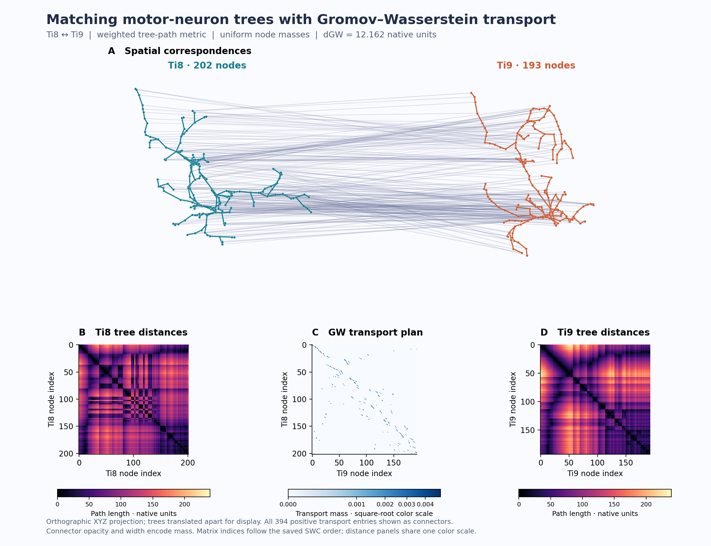

# SWC Gromov–Wasserstein experiments

Compute weighted tree adjacency and shortest-path distance matrices from neuron SWCs, estimate Gromov–Wasserstein (GW) transport, and inspect the results in an offline browser visualizer.

Includes two source motor-neuron SWCs (Ti8 and Ti9), a 180° rotation control, controlled branch deformations, shuffled target ordering, and **252 deformation-study solver runs**. All source vertices are retained. The visualizer links seven matrix panels to 3D skeletons and transport connectors, with experiment, ordering-protocol, and initialization selectors.

## Example: Ti8 ↔ Ti9



**Top:** all SWC nodes and parent–child edges, shown in an orthographic projection of their 3D coordinates and translated apart for readability. The 394 connectors represent positive entries of the saved GW transport plan; thicker, darker lines carry more mass. These are estimated correspondences between two different neurons, not known biological matches.

**Below:** the Ti8 distance matrix, the transport plan (Ti8 rows × Ti9 columns), and the Ti9 distance matrix. Distances sum segment lengths along tree paths and share a color scale. Transport colors use a square-root scale to expose smaller masses. The resulting **GW distance is 12.162 native units** under the convention described below.

This static preview renders directly on GitHub. Use the offline interactive viewer for rotation, matrix/node hover, and deformation experiments. [Download the vector figure](assets/gw-demonstration.svg).

## Open the results

Open **[index.html](index.html)** in Chrome, Edge, or Firefox. Download or clone the repository first; GitHub's HTML source preview does not run the viewer. The committed page is self-contained and works offline without Python, Node, Codex, or a server. Chrome is covered by the browser checks.

```sh
git clone https://github.com/evarol/swc-gw.git
cd swc-gw
```

On macOS, `open index.html` opens it in the default browser. It starts on the mild 5% bow with shuffled target rows. `index.html#original` selects the original Ti8–Ti9 comparison.

## Reproduce the analysis

Use Python 3.11 or newer. Dependencies are pinned in `requirements.txt`; reproduction needs only the bundled `sources/` and `selected_provenance.json`, not the original larger dataset checkout.

```sh
python3 -m venv .venv
source .venv/bin/activate
python -m pip install -r requirements.txt

export OPENBLAS_NUM_THREADS=1
export OMP_NUM_THREADS=1
export VECLIB_MAXIMUM_THREADS=1

python compute_gw.py > computation.log
python verify_exports.py
python compute_rotation.py > rotation_computation.log
python compute_deformations.py > deformation_computation.log
python verify_deformations.py
python export_browser.py
```

`export_browser.py` rebuilds the page using only repository assets, including hash-checked bundled JavaScript. It does not require network access or a Codex installation. Python is sufficient to rebuild the page from committed results; the numerical packages are needed only to recompute them.

## Browser checks

```sh
npm ci
npx playwright install chromium
npm test
```

The tests open the local HTML page with network access disabled and exercise matrix/3D hover, pinning, rotation, target shuffling, selection of saved GW starts, matrix differences, and responsive layout. Screenshots are generated under `checks/` and ignored by Git.

To use an existing browser binary instead of Playwright's download:

```sh
PLAYWRIGHT_CHROMIUM_EXECUTABLE_PATH="/Applications/Google Chrome.app/Contents/MacOS/Google Chrome" npm test
```

## Method and findings

- **Implementation:** POT 0.9.7.post1, `ot.gromov.gromov_wasserstein`, unregularized square loss, conditional gradient with closed-form line search.
- **Metric:** Euclidean parent–child edge lengths, summed along each unique tree path. Uniform node masses.
- **Starts:** independent product, root-distance and mean-distance OT, and nine random-cost OT plans.
- **Distance convention:** `dGW = 0.5 * sqrt(square-loss objective)`.
- Rotation and length-preserving bends leave this tree metric unchanged.
- Mild bows recover every synthetic correspondence in the best runs. Stronger cases fall to approximately 81% recovery.
- Matched initialization plans give identical transports after undoing target shuffling. Fresh random starts often reach poor local optima.

Coordinate units are unverified native units. These are local-solver results for selected synthetic transformations, not globally certified distances or general robustness thresholds. Known node identities are used only for diagnostics; no identity matching constraint is supplied to the solver.

## Files and reports

| Path | Contents |
|---|---|
| `sources/` | Original Ti8/Ti9 SWCs and attribution notes |
| `compute_gw.py` | Original Ti8–Ti9 comparison |
| `compute_rotation.py` | Rotated-duplicate control |
| `compute_deformations.py` | Seven geometries × three protocols × twelve starts |
| `verify_exports.py`, `verify_deformations.py` | Numerical export and reproduction audits |
| `matrices.npz`, `rotation_180/`, `deformation_study/` | Full matrices, transports, SWCs, results, and run histories |
| `viewer_template.html`, `spatial_view.js` | Linked matrix and 3D view |
| `build_viewer.py`, `export_browser.py`, `assets/`, `browser_vendor/` | Portable offline page build |
| `checks/` | Browser tests and captured validation reports |

Read [original methods](README_compute.md), [rotation results](rotation_180/README.md), [deformation results and limitations](deformation_study/README.md), and [interaction details](README_experiments.md). Third-party library notices are in [THIRD_PARTY_NOTICES.md](THIRD_PARTY_NOTICES.md).

## Rebuild the README figure

After installing the analysis dependencies:

```sh
python -m pip install -r requirements-figure.txt
python make_readme_figure.py
```

The script reads the bundled SWCs and saved `matrices.npz`, then writes PNG and SVG figures under `assets/`; it does not rerun the solver.
